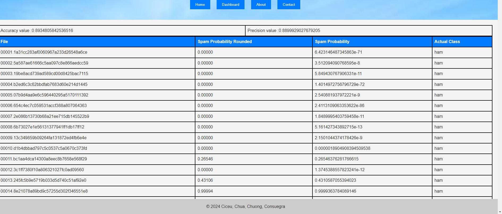

# Assignment 01 - Spam Detector 
CSCI 2020U: Software Systems Development and Integration

Anthony Ciceu, Juan Consuegra, Miles Chua, and Owen Chung

## Project Overview
Our project is an e-mail spam detector that determines whether or not a specific email is spam or not. To do this, it processes an email by creating a **Bag-of-Words** model, which is a representation of text that describes the occurrence of each word. This data is then used in a statistical technique called **Naive Bayes** spam filtering. The technique involves obtaining the probability that the file is spam when it contains a certain word. This method involves utilizing a set of spam and non-spam (ham file) to train the model. First, we divide the probability of the word appearing in a spam file by the sum of the probability of the appearing in a spam and ham file. It is then applied to every word in the file, which gives a set of probabilities. All of these probabilities are then used collectively to compute the probability that the file is spam. Our website provides this information, alongside statistics to measure the precision and accuracy of the model's perception. You can see how this is displayed here:

## Future improvements
While our model has a relatively high accuracy, there are some improvements that we could have made but couldn't due to time constraints. First of all, there is a case where there is a word that is not present in the training data. When this occurs, the word's probability ends up being zero, which negatively affects the model's accuracy. To help remedy this, we could use a technique called **Laplace Smoothing**, which is when a parameter value is added to both the numerator and denominator in the probability calculations. This ensures that we don't obtain any zero probabilities during the calculation. Another element we could consider is to disregard some neutral words, such as "the" and "and". These words are considered stop words, as they have a spamcity next to 0.5 (1 indicates spam, 0 indicates legitimacy). To achieve this, we could add some conditions in our `getWordFrequency()` function to indicate that these words should be ignored. 

## How to Run
In order to run this program, you must first clone this repository to your machine. You can do this by utilizing the `git clone [url]` command with the link to this repository. You must also install the GlassFish application onto your machine. With GlassFish, you can create an instance to run a web server. With this, you can deploy the `SpamDetectorServer` and view the website via the `SpamDetectorClient` `index.html` file. On this page, you can access multiple sections of the site utilizing the navigation bar.

## Resources 
Here is a list of online articles we referenced when developing our spam detector: 

[1] https://machinelearningmastery.com/gentle-introduction-bag-words-model/

[2] https://www.baeldung.com/cs/naive-bayes-classification-performance

[3] https://en.wikipedia.org/wiki/Bag-of-words_model

[4] https://en.wikipedia.org/wiki/Naive_Bayes_spam_filtering

